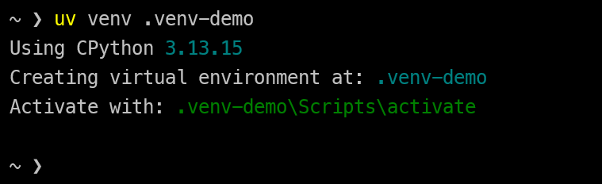
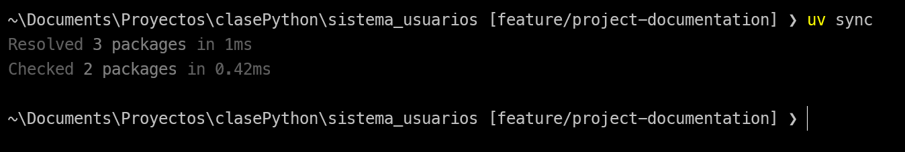
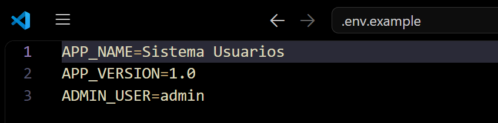
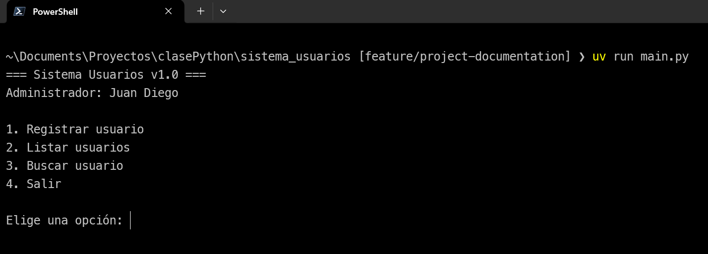

# Sistema Modular de Configuración y Gestión de Usuarios

Aplicación de consola en Python para registrar, listar y buscar usuarios. Está organizada en módulos y paquetes, usa un entorno virtual gestionado con [uv](https://docs.astral.sh/uv/) y lee su configuración desde variables de entorno con `python-dotenv`.

## Requisitos

- Git
- [uv](https://docs.astral.sh/uv/getting-started/installation/)
- Python 3.14 (la versión del proyecto está fijada en `.python-version`)

## Puesta en marcha

### 1. Clonar el repositorio

```bash
git clone https://github.com/juand4cevedo-coder/sistema_usuarios.git
cd sistema_usuarios
```

### 2. Crear y activar el entorno virtual

```bash
uv venv
```

Activación en Windows (PowerShell):

```powershell
.venv\Scripts\activate
```

Activación en macOS y Linux:

```bash
source .venv/bin/activate
```

Con uv la activación es opcional, porque `uv run` usa el entorno del proyecto automáticamente.

### 3. Instalar las dependencias

```bash
uv sync
```

Instala exactamente las versiones registradas en `uv.lock`. Si prefieres pip, también hay un `requirements.txt`:

```bash
pip install -r requirements.txt
```

### 4. Configurar las variables de entorno

Copia la plantilla y ajusta los valores si lo necesitas:

```bash
cp .env.example .env
```

En PowerShell: `Copy-Item .env.example .env`

### 5. Ejecutar

```bash
uv run main.py
```

## Estructura del proyecto

```
sistema_usuarios/
├── app/
│   ├── __init__.py
│   ├── config/
│   │   ├── __init__.py
│   │   └── settings.py       # carga de variables de entorno
│   └── usuarios/
│       ├── __init__.py
│       ├── gestor.py         # registro, listado y búsqueda
│       └── validaciones.py   # validación de nombre y edad
├── docs/img/                 # capturas de pantalla
├── .env.example              # plantilla de variables (sin secretos)
├── main.py                   # punto de entrada: menú de consola
├── pyproject.toml            # metadatos y dependencias
├── requirements.txt          # dependencias exportadas desde uv.lock
├── uv.lock                   # versiones exactas resueltas por uv
└── README.md
```

## Módulos y paquetes

Un **módulo** es un archivo `.py` y un **paquete** es una carpeta con un `__init__.py`. Cada módulo tiene una única responsabilidad:

| Módulo | Responsabilidad |
|---|---|
| `app/usuarios/gestor.py` | Clase `GestorUsuarios`: registrar, listar y buscar usuarios en memoria. |
| `app/usuarios/validaciones.py` | Reglas de validación (nombre no vacío, edad numérica y en rango) y la excepción `ValidacionError`. |
| `app/config/settings.py` | Lee las variables de entorno y las expone como un objeto `settings` inmutable. |
| `main.py` | Menú de consola. Coordina los módulos y muestra los errores al usuario. |

Los módulos se importan con rutas absolutas, por ejemplo `from app.usuarios.gestor import GestorUsuarios`. El proyecto debe ejecutarse desde la raíz del repositorio.

## Variables de entorno

| Variable | Descripción | Valor de ejemplo |
|---|---|---|
| `APP_NAME` | Nombre que se muestra al iniciar | `Sistema Usuarios` |
| `APP_VERSION` | Versión que se muestra al iniciar | `1.0` |
| `ADMIN_USER` | Usuario administrador mostrado en el banner | `admin` |

`python-dotenv` carga el archivo `.env` al importar `settings.py`. Si una variable no existe, se usa un valor por defecto.

**Uso seguro:** el archivo `.env` está en `.gitignore` y nunca se sube al repositorio. Solo se versiona `.env.example`, que documenta qué variables se necesitan sin exponer valores reales.

## Dependencias

| Paquete | Tipo | Uso |
|---|---|---|
| `python-dotenv` | Producción | Leer el archivo `.env` |
| `ruff` | Desarrollo | Linter y formateador |

La fuente de verdad es `uv.lock`. Si cambian las dependencias, regenera `requirements.txt`:

```bash
uv export --format requirements.txt --no-dev --no-hashes --output-file requirements.txt
```

## Calidad de código

```bash
uv run ruff check --fix .
uv run ruff format .
```

## Flujo de trabajo

El repositorio sigue GitFlow (`main`, `develop`, `feature/*`, `release/*`) y [Conventional Commits](https://www.conventionalcommits.org/).


## Evidencias

### Creación del entorno virtual


### Instalación de dependencias


### Uso de variables de entorno


### Ejecución del sistema
